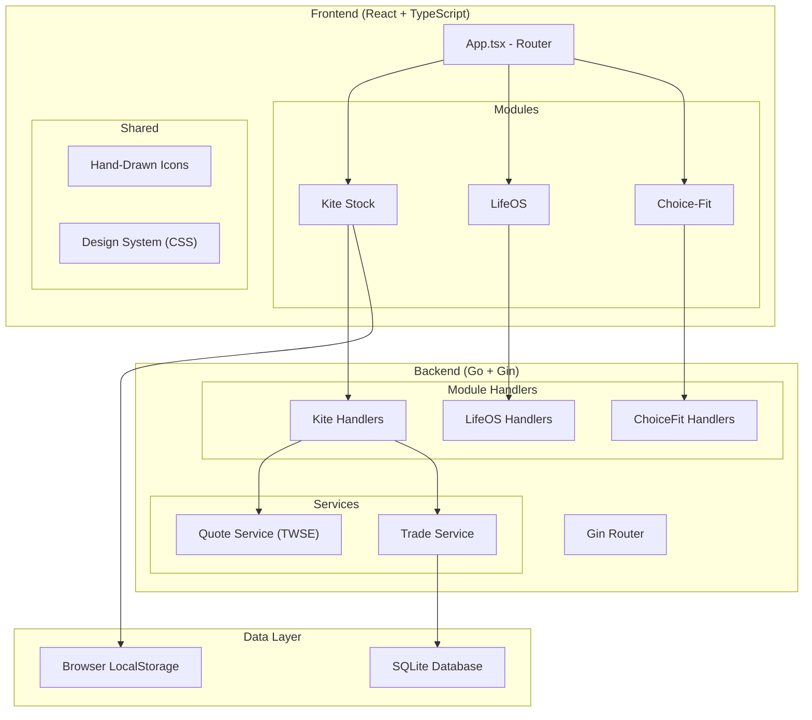
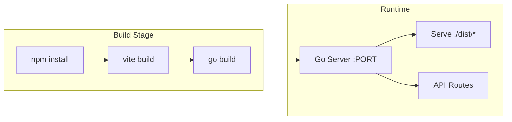

# 📦 Nexus MVP - Product Documentation

> **Version**: 1.0.0 (MVP)  
> **Last Updated**: 2026-01-20  
> **Architecture**: Modular Monolith (Go + React)

---

## 📋 Table of Contents

1. [Product Overview](#product-overview)
2. [System Architecture](#system-architecture)
3. [Modules Overview](#modules-overview)
4. [Kite Stock Module](#kite-stock-module)
5. [LifeOS Module](#lifeos-module)
6. [Choice-Fit Module](#choice-fit-module)
7. [Technical Stack](#technical-stack)
8. [API Reference](#api-reference)
9. [Deployment](#deployment)

---

## 🎯 Product Overview

**Nexus** is a modular monolith platform designed to host multiple personal productivity and finance applications under a unified architecture. The platform enables independent development of distinct modules while sharing core infrastructure.

### Vision

A personal productivity hub that combines:
- **Financial tracking** - Monitor investments and trading strategies
- **Life management** - Track habits and tasks
- **Health & fitness** - (Planned) Fitness coaching and tracking

### Key Design Principles

| Principle | Description |
|-----------|-------------|
| **Modular Architecture** | Each app is an isolated module with its own frontend and backend |
| **Shared Core** | Common database, authentication, and UI components |
| **Lazy Loading** | Frontend modules are loaded on-demand for performance |
| **Mobile-First** | Responsive design optimized for mobile devices |
| **Bilingual UI** | Chinese and English labels throughout the interface |

---

## 🏗️ System Architecture



---

## 📱 Modules Overview

| Module | Status | Description | Route |
|--------|--------|-------------|-------|
| **Kite Stock** | ✅ Complete | Stock strategy visualization and trade journal | `/kite` |
| **LifeOS** | 🚧 MVP | Personal productivity dashboard | `/admin` |
| **Choice-Fit** | 📝 Planned | Fitness coaching platform | `/choice-fit` |

---

## 🪁 Kite Stock Module
詳細功能與 BDD 規格請參考：[`openspec/specs/kite/spec.md`](file:///d:/Code/project/Nexus/openspec/specs/kite/spec.md)

---

## 🧠 LifeOS Module
詳細功能與 BDD 規格請參考：[`openspec/specs/lifeos/spec.md`](file:///d:/Code/project/Nexus/openspec/specs/lifeos/spec.md)

**主要子系統**：
- **Habit Tracker**: 習慣與打卡追蹤
- **Todo Board**: Kanban 任務與 F.L.O.W. 法則管理
- **War Room**: 跨模組儀表板聚合
- **Skincare Engine**: 根據生理週期的護膚排程與守門員防呆系統

---

## 💪 Choice-Fit Module
詳細功能與 BDD 規格請參考：[`openspec/specs/choicefit/spec.md`](file:///d:/Code/project/Nexus/openspec/specs/choicefit/spec.md) (規劃中)

---

## 🛠️ Technical Stack

### Frontend

| Technology | Purpose |
|------------|---------|
| **React 18** | UI framework |
| **TypeScript** | Type safety |
| **Vite** | Build tool and dev server |
| **React Router 6** | Client-side routing |
| **Vanilla CSS** | Styling with CSS custom properties |
| **LocalStorage** | Client-side data persistence (wind history) |

### Backend

| Technology | Purpose |
|------------|---------|
| **Go 1.21+** | Server runtime |
| **Gin** | HTTP web framework |
| **GORM** | ORM for database operations |
| **SQLite** | Embedded database |

### External Integrations

| Service | Purpose |
|---------|---------|
| **TWSE API** | Taiwan Stock Exchange real-time quotes |
| **Railway** | Cloud deployment platform |

---

## 📡 API Reference

### Base URL

- **Development**: `http://localhost:8080`
- **Production**: `https://your-app.railway.app`

---

### Kite Stock APIs

#### GET `/api/kite/ping`

Health check for Kite module.

**Response**:
```json
{ "message": "Kite Stock Module Online" }
```

---

#### GET `/api/kite/quote`

Fetch real-time stock quote from TWSE.

**Query Parameters**:
| Param | Type | Description |
|-------|------|-------------|
| `symbol` | string | Stock code (e.g., "2330") |

**Response**:
```json
{
  "symbol": "2330",
  "company_name": "台積電",
  "price": 595.00,
  "change_percent": 1.25,
  "volume": 15234567,
  "trade_value": 9056000000,
  "ma5": 590.50,
  "ma20": 585.25,
  "ma60": 570.00,
  "deviation_ma20": 1.67,
  "deviation_ma60": 4.39,
  "macd_histogram": 2.35,
  "macd_histogram_days": 5,
  "macd_weekly_trend": "UP"
}
```

---

#### GET `/api/kite/quotes`

Fetch multiple stock quotes at once.

**Query Parameters**:
| Param | Type | Description |
|-------|------|-------------|
| `symbols` | string | Comma-separated stock codes |

---

#### POST `/api/kite/journal`

Create a new trade entry.

**Request Body**:
```json
{
  "symbol": "2330",
  "company_name": "台積電",
  "entry_price": 595.00,
  "quantity": 1000,
  "planned_batches": 5,
  "current_batch": 1,
  "strategy": "BOSS",
  "sub_strategy": "WEEKLY_PULLBACK",
  "cycle": "EASY_FALL",
  "stop_loss_price": 565.00,
  "take_profit_price": 650.00,
  "strategy_snapshot": {
    "ma20_deviation": 1.67,
    "ma60_deviation": 4.39,
    "macd_days": 5,
    "weekly_trend": "UP",
    "current_price": 595.00
  }
}
```

---

#### GET `/api/kite/portfolio`

Get active portfolio with real-time P/L calculations.

**Response**:
```json
{
  "holdings": [
    {
      "id": "uuid",
      "symbol": "2330",
      "company_name": "台積電",
      "entry_price": 595.00,
      "quantity": 1000,
      "current_price": 598.00,
      "unrealized_pl": 3000,
      "unrealized_pl_percent": 0.50,
      "cost_basis": 595000,
      "market_value": 598000,
      "days_held": 5,
      "strategy_alerts": []
    }
  ],
  "alerts": [],
  "total_cost": 595000,
  "market_value": 598000,
  "total_pl": 3000,
  "total_pl_percent": 0.50
}
```

---

#### POST `/api/kite/trade/:id/settle`

Close a trade position.

**URL Parameters**:
| Param | Type | Description |
|-------|------|-------------|
| `id` | string | Trade UUID |

**Request Body**:
```json
{
  "exit_price": 610.00,
  "exit_notes": "Target reached"
}
```

---

#### DELETE `/api/kite/trade/:id`

Delete a trade entry.

---

#### GET `/api/kite/history`

Get closed trade history with statistics.

**Response**:
```json
{
  "trades": [...],
  "total_pl": 25000,
  "win_rate": 66.67,
  "total_trades": 12,
  "wins": 8,
  "best_strategy": "BOSS",
  "best_pl": 18000
}
```

---

#### POST `/api/kite/import`

Import a historical trade.

**Request Body**:
```json
{
  "symbol": "2330",
  "company_name": "台積電",
  "strategy": "BOSS",
  "sub_strategy": "WEEKLY_PULLBACK",
  "entry_price": 550.00,
  "exit_price": 600.00,
  "quantity": 2000,
  "entry_date": "2025-11-01",
  "exit_date": "2025-12-15",
  "notes": "Great trade"
}
```

---

#### Wind APIs

| Method | Endpoint | Description |
|--------|----------|-------------|
| GET | `/api/kite/wind/latest` | Get today's wind record |
| GET | `/api/kite/wind/history` | Get past N days of wind |
| POST | `/api/kite/wind` | Save a wind record |

---

### LifeOS APIs

#### GET `/api/lifeos/ping`

Health check for LifeOS module.

---

### Choice-Fit APIs

#### GET `/api/choicefit/ping`

Health check for Choice-Fit module.

---

## 🚀 Deployment

### Railway Deployment

The application is configured for Railway deployment with:

| File | Purpose |
|------|---------|
| `Dockerfile` | Multi-stage build for Go + React |
| `railway.toml` | Railway-specific configuration |

### Build Process



### Environment Variables

| Variable | Description | Default |
|----------|-------------|---------|
| `PORT` | Server port | 8080 |
| `DATABASE_URL` | Database path | ./nexus.db |

---

## 📊 Data Models

### WindRecord

```go
type WindRecord struct {
    ID        string    `gorm:"primaryKey"`
    Date      string    `gorm:"uniqueIndex"`
    Wind      string    // STRONG, TURBULENT, GUSTY, CALM
    CreatedAt time.Time
}
```

### TradeEntry

```go
type TradeEntry struct {
    ID              string `gorm:"primaryKey"`
    Symbol          string
    CompanyName     string
    EntryPrice      float64
    ExitPrice       float64
    Quantity        int
    PlannedBatches  int
    CurrentBatch    int
    Strategy        string    // OFFICE, BOSS
    SubStrategy     string    // STRONG_WEEKLY, etc.
    Cycle           string    // EASY_RISE, etc.
    StopLossPrice   float64
    TakeProfitPrice float64
    Status          string    // OPEN, CLOSED
    StrategySnapshot JSON     // Entry conditions
    ExitNotes       string
    FinalPL         float64
    FinalPLPercent  float64
    CreatedAt       time.Time
    ClosedAt        *time.Time
}
```

---

## 🎨 Design System

### Color Palette

| Token | Value | Usage |
|-------|-------|-------|
| `--bg-base` | `#0f172a` | Page background |
| `--bg-surface` | `#1e293b` | Card backgrounds |
| `--accent` | `#f59e0b` | Primary accent (amber) |
| `--success` | `#10b981` | Positive values |
| `--danger` | `#ef4444` | Negative values |
| `--text-primary` | `#f1f5f9` | Main text |
| `--text-secondary` | `#94a3b8` | Muted text |

### Typography

| Element | Font | Size |
|---------|------|------|
| Headings | System | 1.5rem - 2rem |
| Body | System | 1rem |
| Mono (prices) | `monospace` | 1.25rem |

### Hand-Drawn Icons

Custom SVG icons with organic, hand-drawn aesthetic:

- `IconLifeOS` - Brain/dashboard icon
- `IconKite` - Flying kite
- `IconChoiceFit` - Dumbbell
- `IconDashboard` - Grid layout
- `IconSettings` - Gear
- `IconStrongWind`, `IconTurbulence`, `IconGust`, `IconNoWind` - Wind types
- `IconBOSS` - Shield (Boss strategy)
- `IconCompany` - Building (Office strategy)

---

## 📝 Future Roadmap

### Short-term (v1.1)

- [ ] LifeOS persistence layer (GORM)
- [ ] User authentication
- [ ] Push notifications for stop-loss alerts

### Medium-term (v1.5)

- [ ] Choice-Fit module implementation
- [ ] Multi-user support
- [ ] Trade analytics dashboard

### Long-term (v2.0)

- [ ] Mobile app (React Native)
- [ ] AI-powered trade suggestions
- [ ] Integration with more brokers

---

> **Generated with ❤️ for the Nexus Project**
